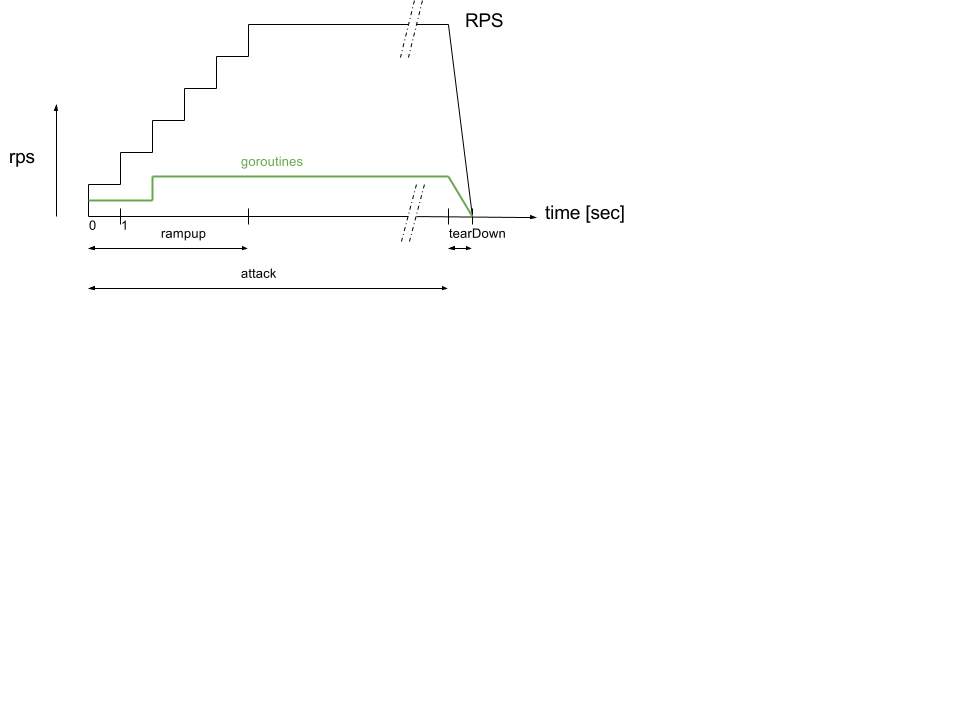

# hazana - package for creating load tests of services

Hazana was created to create load tests that use (generated) gRPC clients in Go to communicate to gRPC services (in any language). However, by providing the Attack interface, any client and protocol could potentially be tested with this package.

Compared to existing HTTP load testing tools (e.g. tsenart/vegeta) that can send raw HTTP requests, this package requires the use client code to perform the request. 
Consequently, time to send a request and receive a response includes time spent on marshalling that request and unmarshalling a response.

### Attack

    // Attack must be implemented by a service client.
    type Attack interface {

        // Setup should establish the connection to the service
        // It may want to access the config of the runner.
        Setup(c Config) error

        // Do performs one request and is executed in one fixed goroutine.
        Do() DoResult

        // Teardown should close the connection of the service
        Teardown() error

        // Clone should return a new fresh Attack
        Clone() Attack
    }
    
The **hazana** runner will spawn goroutines to meet this load.
Each goroutine will use one Attack value to perform the communication ( see **Do()** ).
Typically each Attack value uses its own connection but your implementation can use another strategy.

### Rampup
The **hazana** runner will use a rampup period in which the RPS is increased (every second) during the rampup time. In this phase, new goroutines are spawned up to the given maximum. Currently, one rampup strategy is implemented that will create exactly the maximum number of goroutines within the rampup period. A more efficient and dynamic strategy is to spawn goroutines as needed to match the current rps load during rampup.
 

### Flags
Programs that use the **hazana** package will have several flags to control the load runner.

    Usage of <<your load test program>>:
        -attack int
                duration of the attack in seconds (default 60)
        -max int
                maximum concurrent attackers (default 10)
        -o string
                output file to write the metrics per sample request index (use stdout if empty)
        -ramp int
                ramp up time in seconds (default 10)
        -rps int
                target number of requests per second, must be greater than zero (default 1)
        -t	perform one sample call to test the attack implementation
        -v	verbose logging

 # Sample verbose output

        2017/08/17 10:16:04 begin rampup of [10] seconds
        2017/08/17 10:16:04 setup and spawn new attacker [1]
        2017/08/17 10:16:06 current rate [1.9960095577320867], target rate [1], attackers [1], mean response time [239.731505ms]
        2017/08/17 10:16:06 setup and spawn new attacker [2]
        2017/08/17 10:16:08 current rate [2.995615446482448], target rate [2], attackers [2], mean response time [52.711975ms]
        2017/08/17 10:16:08 setup and spawn new attacker [3]
        2017/08/17 10:16:09 current rate [3.9940172776454523], target rate [3], attackers [3], mean response time [52.556342ms]
        2017/08/17 10:16:09 setup and spawn new attacker [4]
        2017/08/17 10:16:10 current rate [4.995255710931241], target rate [4], attackers [4], mean response time [52.758959ms]
        2017/08/17 10:16:10 setup and spawn new attacker [5]
        2017/08/17 10:16:11 current rate [5.998102842057777], target rate [5], attackers [5], mean response time [52.201352ms]
        2017/08/17 10:16:11 setup and spawn new attacker [6]
        2017/08/17 10:16:13 current rate [6.969296346786452], target rate [6], attackers [6], mean response time [52.234799ms]
        2017/08/17 10:16:13 setup and spawn new attacker [7]
        2017/08/17 10:16:14 current rate [7.960364810265246], target rate [7], attackers [7], mean response time [46.410523ms]
        2017/08/17 10:16:14 setup and spawn new attacker [8]
        2017/08/17 10:16:15 current rate [8.977063700991666], target rate [8], attackers [8], mean response time [42.631875ms]
        2017/08/17 10:16:15 setup and spawn new attacker [9]
        2017/08/17 10:16:16 current rate [9.987331858536663], target rate [9], attackers [9], mean response time [40.153125ms]
        2017/08/17 10:16:16 setup and spawn new attacker [10]
        2017/08/17 10:16:17 current rate [10.990121847690736], target rate [10], attackers [10], mean response time [35.309883ms]
        2017/08/17 10:16:17 end rampup ending up with [10] attackers
        2017/08/17 10:16:17 begin full attack of [10] remaining seconds
        2017/08/17 10:16:27 end full attack
        2017/08/17 10:16:27 stopping attackers [10]
        2017/08/17 10:16:27 tearing down attackers [10]
        {
                "StartedAt": "2017-08-17T10:16:04.614767156+02:00",
                "FinishedAt": "2017-08-17T10:16:27.611458055+02:00",
                "Configuration": {
                        "RPS": 10,
                        "AttackTimeSec": 20,
                        "RampupTimeSec": 10,
                        "MaxAttackers": 10,
                        "OutputFilename": "",
                        "Verbose": true,
                        "Metadata": {}
                },
                "Metrics": {
                        "item.xml": {
                                "latencies": {
                                        "total": 3481658360,
                                        "mean": 34471864,
                                        "50th": 31499775,
                                        "95th": 33819046,
                                        "99th": 38841409,
                                        "max": 298431786
                                },
                                "earliest": "2017-08-17T10:16:17.571177051+02:00",
                                "latest": "2017-08-17T10:16:27.572539363+02:00",
                                "end": "2017-08-17T10:16:27.611380772+02:00",
                                "duration": 10001362312,
                                "wait": 38841409,
                                "requests": 101,
                                "rate": 10.09862425229976,
                                "success": 1,
                                "status_codes": null,
                                "errors": null
                        }
                }
        }

© 2017, [ernestmicklei.com](http://ernestmicklei.com).  Apache v2 License. Contributions welcome.
